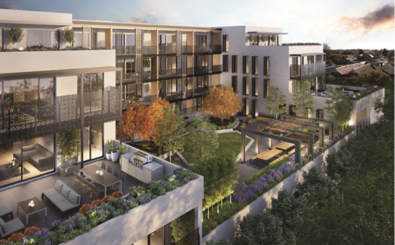
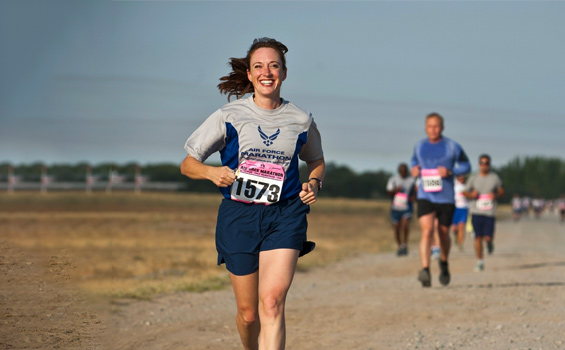
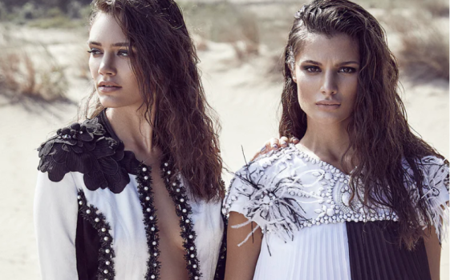

<section class="homepage_intro">
    <h6>Hello</h6>
    <h1>I'm Angelica Lopez</h1>
    <h1>UI & UX Designer</h1>
     
Creative design professional with experience in delivering
  innovative solutions that elevate User Experience.

     <button type="button">VIEW RESUME</button>
    
  </section>
    
 <section class="projects">
      <h6>Portfolio</h6>
      <h3>Projects</h3>
    

        

        
       

        <h4>Eni Bebic | Creating the website</h4>
        <button type="button">VIEW CASE STUDY</button>
       

      

        

        
      

        <h4>Racemappr | Onbording Process</h4>
        <button type="button">VIEW CASE STUDY</button>
       

      

        

        
      

        <h4>Craigslist | Redesign</h4>
        <button type="button">VIEW CASE STUDY</button>

      

        

        
      

        <h4>Exie | Brand & web design</h4>
        <button type="button">VIEW CASE STUDY</button>
       

    </section>
    
<section class="aboutme">
      <h3>About Me</h3>
      
Skilled in executing a design process based on understanding user needs and behavior through hands-on research, competitor analysis, and prototype testing. I care about the details and consider good visual communication to be crucial in creating effective interfaces, models, and new  possibilities. 

    </section>
    <section class="contactme">
      <h6>Contact</h6>
      <h3>Get in Touch</h3>
      
If you have questions related to my projects, or would like to work on a new project  feel free to reach out.

      <address>
        <a href="mailto:angelica.lopezrincon@gmail.com">angelica.lopezrincon@gmail.com</a>
      </address>
    </section>  